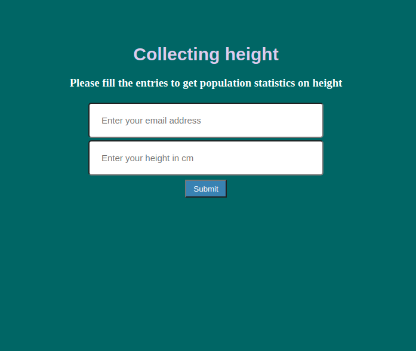

# Collecting-height
Web application for collecting height data

## Desktop application that I used for coding part
```
Atom
```

## Databases used in the project
```
1. PostgreSQL (local database)
2. SQLAlchemy (library for operating with PostgreSQL database)
3. MySQL (database created inside pythonanywhere.com server)
```

## Framework used for deploying the Web App
```
Flask
```

## Web hosting service
```
[PythonAnywhere](https://www.pythonanywhere.com/)
```

## Web application link
```
[Collecting height Web App](http://kixelo.pythonanywhere.com/)
```

## App idea:
```
App created according to the Udemy lesson by Ardit Sulce.
```
## App Images:

